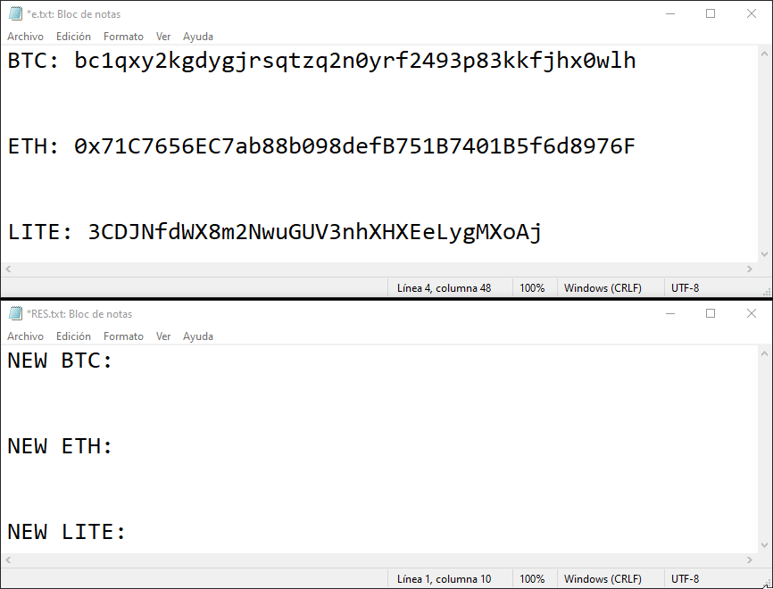

<h1 align="center">CRYPTO REPLACER</h1>

</img>

# Description 📌

This script is a tool to automatically replace cryptocurrency addresses in the clipboard with a predefined address. This can be useful to avoid accidentally sending cryptocurrency to the wrong address.

## Starting 🚀

### Requirements:

```
pyperclip
time
re
ctypes
os
sys
inspect
```

### Downloading:

```
git clone https://github.com/matifanger/crypto-replacer
cd crypto-replacer
pip3 install -r requirements.txt
```

## Configuring ⚙️

Open (`crypto-replacer.py`).
Look for variable (`my_addresses`) and setup with anything you want.

### Making the binaries:

When the configuration is done you should make the executable (`.exe`) to work in windows.

```
pip install auto-py-to-exe
```

then

```
auto-py-to-exe
```

In Auto Py To Exe (Mandatory)

```
One directory
Console based
```

Proper usage [here](https://pypi.org/project/auto-py-to-exe/)

## Regex cryptos - Supported 📖

- Bitcoin
- Ethereum
- Dash
- Cardano
- Polkadot
- Ripple
- Tron
- Litecoin
- Monero
- Doge
- Solana

## Todo 📄

- [x] Add more cryptos
- [ ] Add linux support
